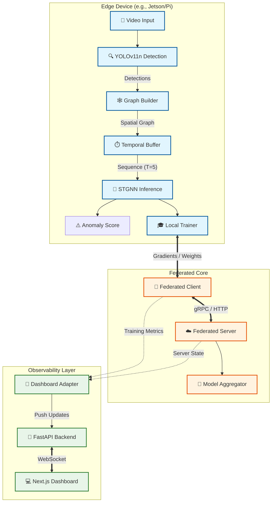

# STGNN Crowd Analysis & Federated Learning System

**A Privacy-Preserving, Real-Time Crowd Anomaly Detection System using Spatio-Temporal Graph Neural Networks.**

This project implements a complete pipeline for crowd analysis (anomaly detection, stampede prediction) using **YOLOv11** for person detection and **STGNN** for modeling spatial-temporal dependencies. It features a robust **Federated Learning** architecture to train models across distributed edge devices without sharing raw video data, monitored by a real-time **Observability Dashboard**.

---

## 🏗️ System Architecture

The system consists of three main layers: **Edge Intelligence**, **Federated Core**, and **Observability**.



---

## 🧩 Key Components

### 1. Edge Intelligence Pipeline
The core logic running on edge devices (located in `src/`).
- **YOLOv11 Detector** (`src/yolo_detector.py`): Detects persons in video frames. Returns bounding boxes and centroids.
- **Graph Builder** (`src/run_pipeline_realtime.py`): Converts detections into a spatial graph.
    - **Nodes**: Detected persons.
    - **Edges**: Connected if distance < `GRAPH_RADIUS`.
    - **Features**: Position (x, y), Velocity (dx, dy), Local Density.
- **STGNN Model** (`src/models/stgnn.py`): A Spatio-Temporal Graph Convolutional Network.
    - **Input**: Sequence of 5 graphs.
    - **Output**: Predicted future positions.
    - **Anomaly**: High deviation between *Predicted* vs *Actual* position = **Anomaly**.
- **Real-Time Inference**: Uses ONNX Runtime for optimized performance on edge hardware.

### 2. Federated Learning System
Enables collaborative training without sharing private video data (located in `src/federated/`).
- **Federated Server**: Orchestrates training rounds, manages client selection, and aggregates global model weights.
- **Federated Client**: interconnects the Local Trainer with the Server. Only communicates model weights/gradients.
- **Local Trainer**: Performs STGNN training on the local device using the edge's own collected data.

### 3. Dashboard Interconnectivity
A comprehensive monitoring suite (located in `dashboard_external/`).
- **Dashboard Backend**: A **FastAPI** application that serves as a read-only observability layer. It receives real-time snapshots from the Federated Server via an in-memory **Adapter**.
- **Dashboard Frontend**: A **Next.js** + **TypeScript** application visualizing:
    - Real-time training status of all nodes.
    - Global model accuracy and loss curves.
    - System health (CPU/Memory/Network).
    - Live anomaly alerts.

---

## 📂 Project Structure

```text
d:\stgnn_project\
├── src/                        # Core Edge & FL Logic
│   ├── models/                 # PyTorch & ONNX Models
│   │   └── stgnn.py            # STGNN Definition
│   ├── federated/              # Federated Learning Core
│   │   ├── server/             # FL Server Logic
│   │   ├── client/             # FL Client Logic
│   │   └── transport/          # Communication Protocol
│   ├── yolo_detector.py        # YOLOv11 Wrapper
│   └── run_pipeline_realtime.py # Single-Node Inference Entry
├── dashboard_external/         # Observability Stack
│   ├── dashboard_backend/      # FastAPI Server
│   │   └── main.py             # Backend Entry Point
│   └── dashboard-frontend/     # Next.js Web App
├── integration/                # System Integration
│   └── run_with_dashboard.py   # 🏁 MAIN ENTRY POINT (FL + Dashboard)
├── data/                       # Datasets & Videos
└── outputs/                    # Logs & checkpoints
```

---

## 🚀 Installation & Usage

### Prerequisites
- **Python 3.8+**
- **Node.js 18+** & **npm**
- CUDA-capable GPU (Recommended for YOLO/STGNN)

### 1. Setup Environment
```bash
# Install Python dependencies
pip install -r requirements.txt

# Install Frontend dependencies
cd dashboard_external/dashboard-frontend
npm install
```

### 2. Running the Full System (Federated + Dashboard)
This script simulates the entire ecosystem: it starts the Federated Server, initializes mock Edge Clients (simulating video feeds), and launches the Dashboard Backend.

```bash
# From project root
python integration/run_with_dashboard.py --num-clients 3 --rounds 10
```
*The Dashboard Backend API will start at `http://127.0.0.1:8000`.*

### 3. Launching the Visualization (Frontend)
While the simulation is running, start the frontend to view the data.

```bash
cd dashboard_external/dashboard-frontend
npm run dev
```
Open **[http://localhost:3000](http://localhost:3000)** in your browser.

### 4. Running Single-Node Inference
 To run the anomaly detection pipeline on a single video file without federated learning:

```bash
# Set environment variables (optional, defaults provided in script)
set VIDEO_SOURCE=data/videos/my_video.mp4

# Run pipeline
python src/run_pipeline_realtime.py
```

---

## 🔧 Configuration

| Component | File | Key Settings |
|-----------|------|--------------|
| **Pipeline** | `src/run_pipeline_realtime.py` | `GRAPH_RADIUS`, `TEMPORAL_WINDOW`, `ANOMALY_THRESHOLD` |
| **Federated** | `integration/run_with_dashboard.py` | `rounds`, `num_clients`, `samples_per_client` |
| **YOLO** | `src/yolo_detector.py` | `conf_threshold`, `model_path` |

---

## 📜 License
Internal Research Project - Confidential.
